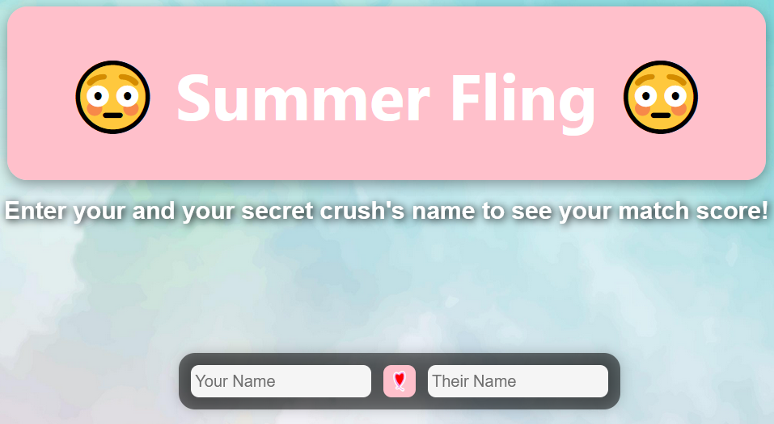
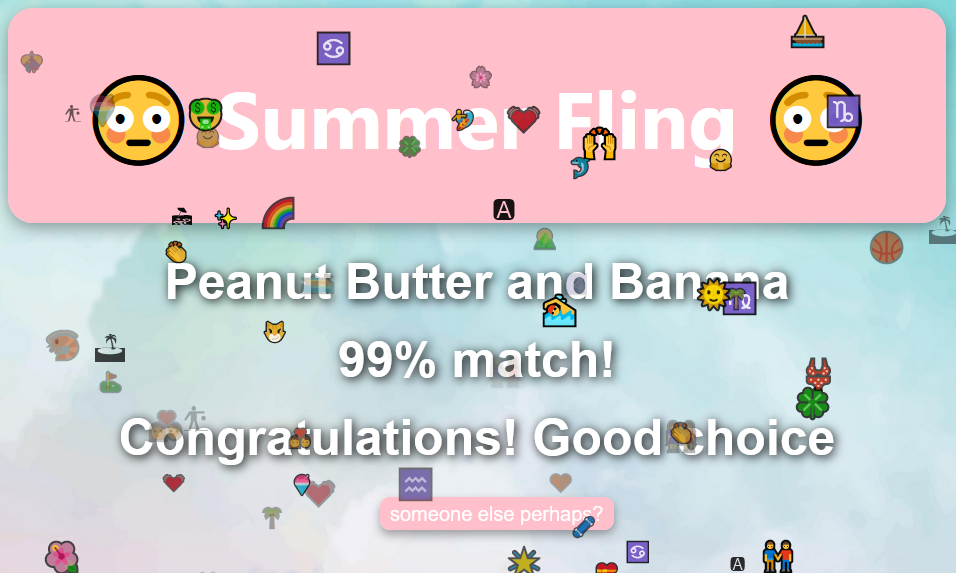

<a href="https://github.com/siddkhannaa/summer-fling/">
    
</a>

# Summer Fling
<div id="top"></div>
<!-- PROJECT LOGO -->

<br />
<div align="center">
  <p align="center">
    <strong>Freyhacks2022 submission</strong>
  </p>
</div>

<!-- ABOUT THE PROJECT -->

## About The Project

The Summer Fling aims to discover the compatibility between two unsuspecting individuals 😍.
Did you ever wonder how compatible you are with your (not-so-secret) crush? How about if your two best friends should get together? Well with our open-source love calculator, you can easily find out! Simply deploy the website on GitHub and enter two names. Share your results with confidence and become a love guru!

Summer Fling is not liable for any emotional damages. Side effects may include heartbreak, depression and/or death.


To see our project in action, watch a quick demo on YouTube!
<!-- LINK YOUTUBE VID HERE
[](https://www.youtube.com/watch?v=52vKAO761o8&ab_channel=RyanHu)
-->

Also feel free to check out the project's [wiki](https://github.com/siddkhannaa/summer-fling/wiki).

### Built With

- React.js
- Javascript
- HTML
- CSS
- [Love Calculator API](https://rapidapi.com/ajith/api/love-calculator/)


<p align="right">(<a href="#top">back to top</a>)</p>


<!-- GALLERY -->

## Gallery




<!-- ADD IMAGES HERE
</img> </img> </img> </img> </img> 
-->

<p align="right">(<a href="#top">back to top</a>)</p>

<!-- GETTING STARTED -->

## Getting Started

### Quickstart

Check out [our Github pages deployment](https://siddkhannaa.github.io/summer-fling/)!

### Building it Yourself

#### Prerequisites

This application was developed and tested using Node.js 16.x.

#### Steps

First, clone this repo:
```
git clone https://github.com/siddkhannaa/summer-fling.git
```

Next, navigate to the repo and install the dependencies:
```
cd summer-fling
npm install
```

Finally, start the server:
```
npm start
```

<p align="right">(<a href="#top">back to top</a>)</p>

<!-- CONTRIBUTING -->

## Contributing

Contributions are what make the open source community such an amazing place to learn, inspire, and create. Any contributions you make are **greatly appreciated**.

If you have a suggestion that would make this better, please fork the repo and create a pull request. You can also simply open an issue with the tag "enhancement".
Don't forget to give the project a star! Thanks again!

1. Fork the Project
2. Create your Feature Branch (`git checkout -b feature/AmazingFeature`)
3. Commit your Changes (`git commit -m 'Add some AmazingFeature'`)
4. Push to the Branch (`git push origin feature/AmazingFeature`)
5. Open a Pull Request

<p align="right">(<a href="#top">back to top</a>)</p>

<!-- ACKNOWLEDGMENTS -->

## Acknowledgments

- CSS - for centering our divs

<p align="right">(<a href="#top">back to top</a>)</p>
